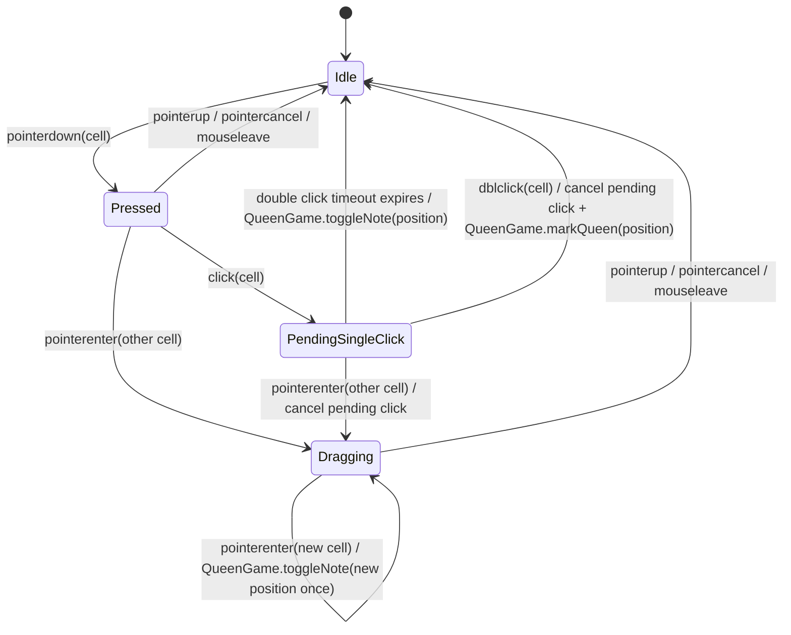

# Project Guide

This document explains how this project is organized, how game state flows through the app, and which conventions to follow when adding or changing features.

Use this as the default guide for new work. When a change touches multiple areas, prefer keeping the structure and naming consistent with the patterns described here instead of introducing a new local style.

Keep `README.md` focused on product overview, setup, usage, and high-level architecture. Small implementation conventions and team-facing coding notes should live in `AGENTS.md` or code-local comments instead of being added to the README.

For detailed state machines and transition tables, use [docs/state.md](./docs/state.md). Keep `AGENTS.md` focused on rules, placement guidance, and the shorter architectural summary.

When updating `README.md`, prioritize:

- game rules and player-facing behavior
- project setup and commands
- high-level architecture
- folder overview

Avoid low-level implementation notes, temporary refactor guidance, or component-specific conventions in the README unless those details are necessary for someone to understand the project at a high level.

## 1. Project Overview

This is a Vue 3 + Vite puzzle game based on the N-Queens problem. TypeScript is used across the codebase, Vue Router handles page navigation, and Vitest / Cypress cover automated testing.

The current product structure is page-driven:

- `HomeView`: landing page and game entry
- `GameView`: active puzzle screen

At a high level, most gameplay follows this flow:

1. A view under `src/views/` owns the screen-level flow.
2. Reusable UI is extracted into `src/components/`.
3. Core game rules live in `src/game/`.
4. Shared type definitions live in `src/types/`.
5. Puzzle data lives in `src/puzzles/`.
6. Small cross-cutting helpers live in `src/utils/`.

The key architectural rule is:

- UI components must not implement or mutate core game rules directly.
- `QueenGame` is the single place where game rules and result state should be decided.

Current interaction flow:

1. `GameCell` emits user intent.
2. `GameBoard` translates that intent into engine calls.
3. `QueenGame` applies the rules.
4. `BoardCell` instances reflect the resulting cell state.

## 2. Directory Guide

### `src/views/`

Views are route-level entry points. They should own:

- screen composition
- page-level actions such as starting, quitting, or requesting a hint
- coordination between router state, UI sections, and the game engine

They should not become dumping grounds for detailed board rendering logic. If a section starts carrying its own presentation behavior, extract it into `src/components/`.

Current examples:

- `src/views/HomeView.vue`
- `src/views/GameView.vue`

### `src/components/`

Components are reusable UI building blocks. Use feature folders when a set of components clearly belongs to one area of the game.

Current examples:

- `src/components/common/BaseButton.vue`
- `src/components/common/HeartCounter.vue`
- `src/components/game/GameBoard.vue`
- `src/components/game/GameCell.vue`

Component extraction is usually a good idea when:

- a template block is long enough to hide the page flow
- a UI block has its own props and rendering rules
- a section should read like a named domain concept

### `src/game/`

This folder owns gameplay state and rules.

Responsibilities:

- create and reset boards
- track hearts and hint usage
- determine win / lose conditions
- update cell state through engine methods

Keep gameplay rules here rather than spreading them across Vue components.

Current examples:

- `src/game/QueenGame.ts`
- `src/game/BoardCell.ts`

`QueenGame` should remain the main entry point for rule changes. `BoardCell` should stay focused on individual cell state and simple cell-level transitions.

### `src/router/`

Router configuration belongs here.

Current route structure:

- `/` -> `HomeView`
- `/game` -> `GameView`

When adding a new page, define the route here and place the route component under `src/views/`.

### `src/types/`

Put reusable TypeScript models and aliases here.

Current examples:

- `src/types/board.ts`
- `src/types/puzzle.ts`

Good fits:

- position tuples
- puzzle definitions
- public game-facing object shapes

If a type is only used inside one component or one class and is not part of a wider contract, keeping it local is acceptable.

### `src/puzzles/`

Puzzle definitions belong here.

Responsibilities:

- define board regions
- define queen positions
- group puzzle sets by board size or difficulty when useful

Keep puzzle data declarative. Validation or gameplay logic should not live inside puzzle definition files.

### `src/utils/`

Utilities belong here when they are shared, pure, and not tied to rendering.

Current example:

- `src/utils/random.ts`

Do not move tiny one-off logic into `utils/` too early. Keep implementation details local until reuse is real.

### `src/stores/`

This folder is reserved for Pinia stores when shared app state is needed.

Right now, the main gameplay flow is driven by `QueenGame`, not by a store. Do not move core puzzle rules into Pinia unless there is a clear architectural reason.

If a store is introduced, use it for:

- cross-view UI state
- app-level preferences
- shared state that must outlive a single screen instance

## 3. Game Architecture

### Engine First

This project should preserve a clear boundary between the UI layer and the game engine.

Prefer this direction:

`UI -> intent -> QueenGame -> BoardCell state`

Avoid this direction:

`UI -> direct cell mutation -> scattered rule handling`

In practice, this means:

- `GameCell` should emit events that describe player actions
- `GameBoard` should wire those actions to engine methods
- `QueenGame` should decide whether hearts change, hints are consumed, or the game ends
- `BoardCell` should not become a second game engine

### `QueenGame`

`QueenGame` is the single source of truth for a running puzzle.

It should own:

- board creation
- heart tracking
- hint usage
- win / lose checks
- reset behavior

If a new gameplay rule is introduced, prefer adding or updating a method on `QueenGame` instead of implementing the rule inside a Vue component.

### `BoardCell`

`BoardCell` represents one square on the board.

It may own:

- row / column position
- region id
- whether the cell actually contains a queen
- local display-oriented status such as `empty`, `note`, `wrong`, or `found`

It should not decide broader game outcomes such as:

- remaining hearts
- whether a hint can still be used
- whether the game has been won or lost

### Views And Components

Views and components should focus on presentation and interaction flow.

Good fits for Vue files:

- rendering board and controls
- forwarding click / pointer events
- showing current hearts or hint availability
- triggering navigation

Poor fits for Vue files:

- deciding penalty rules
- resolving win conditions
- duplicating board validation logic

## 4. UI And Interaction Rules

Prefer components that express domain concepts clearly. If a template block represents a meaningful part of the game, give it a name and extract it instead of leaving it as anonymous markup inside a view.

For interaction handling:

- use emitted events from child components to describe user intent
- keep drag and pointer coordination in board-level UI code
- keep rule evaluation in the engine

When a UI event needs game-state changes beyond a trivial visual toggle, route it through `QueenGame`.

This rule is especially important for:

- queen marking
- wrong guesses and heart deduction
- hint consumption
- win / lose transitions

### Cell Interaction State Machine

The current board interaction model is easiest to reason about as a small state machine coordinated by `GameBoard`.

Use transition tables as the primary documentation format for stateful UI behavior. Mermaid diagrams are helpful as visual aids, but the table should remain the source of truth because it is easier to diff, review, and maintain in Git.

When writing Mermaid diagrams for this repository, prefer GitHub-safe labels. Avoid function-call notation such as `toggleNote()` inside Mermaid transition text; use simplified labels such as `toggleNote` and keep the exact method-style names in tables or prose.

When a feature gains meaningful state complexity, prefer documenting it in [docs/state.md](./docs/state.md) instead of overloading `README.md` or scattering the rules across comments.

| Current State | Event | Next State | Action |
| --- | --- | --- | --- |
| `Idle` | `pointerdown(cell)` | `Pressed` | start pointer session |
| `Pressed` | `click(cell)` | `PendingSingleClick` | schedule note toggle |
| `Pressed` | `pointerenter(other cell)` | `Dragging` | begin drag selection |
| `Pressed` | `pointerup` / `pointercancel` / `mouseleave` | `Idle` | end pointer session |
| `PendingSingleClick` | `dblclick(cell)` | `Idle` | cancel pending note, mark queen |
| `PendingSingleClick` | click timeout | `Idle` | `QueenGame.toggleNote(position)` |
| `PendingSingleClick` | `pointerenter(other cell)` | `Dragging` | cancel pending click, begin drag selection |
| `Dragging` | `pointerenter(new cell)` | `Dragging` | toggle note once per cell |
| `Dragging` | `pointerup` / `pointercancel` / `mouseleave` | `Idle` | end drag session |

Notes:

- `GameCell` emits raw interaction events and does not mutate board state directly.
- `GameBoard` resolves whether a gesture is a single click, a double click, or a drag session.
- single click is intentionally delayed slightly so a following `dblclick` can cancel it cleanly
- drag sessions suppress the trailing click that browsers often emit on release
- note toggling and queen marking should flow through `QueenGame`, not through direct `BoardCell` mutation from the component
- when a state machine becomes central to feature behavior, add both a transition table and a compact Mermaid diagram to `docs/state.md`

User-facing copy should stay consistent across the app. When the project eventually adds localization, prefer centralizing translatable strings rather than hard-coding the same message in multiple components.

## 5. Model And File Placement Rules

When deciding where a new shape or helper should live, use this quick guide:

- Route-level screen: `src/views/`
- Reusable UI block: `src/components/`
- Core gameplay rule or engine behavior: `src/game/`
- Reusable type or interface: `src/types/`
- Declarative puzzle data: `src/puzzles/`
- Shared pure helper: `src/utils/`
- Cross-view shared store: `src/stores/`

Keep types or helpers inside a component file only when they are truly private to that file.

## 6. Testing Guidance

Prefer tests that validate gameplay behavior and user-visible outcomes.

Current testing setup includes:

- Vitest for unit tests
- Cypress for end-to-end tests

Testing priorities:

- `QueenGame` rule correctness
- `BoardCell` state transitions
- key component interaction contracts
- critical player flows such as starting a game and interacting with the board

For engine and utility code, prefer focused unit tests.

For Vue components, prefer testing:

- emitted events
- prop-driven rendering
- visible behavior after interaction

Avoid brittle assertions against:

- generated DOM structure that is not part of the feature contract
- incidental styling details
- framework internals

Use consistent naming for new tests. Prefer `*.test.ts` and `*.test.tsx` across the repository instead of `*.spec.*`.

## 7. Commit Rules

Follow Conventional Commits for commit messages.

Format commit subjects as:

`<type>[optional scope]: <description>`

Use:

- `feat` for new user-facing functionality
- `fix` for bug fixes and behavior corrections
- `refactor` for structural improvements without behavior changes
- `test` for test updates
- `docs` for documentation changes
- `chore` for maintenance work

Keep the subject concise and imperative.

If an AI agent creates the commit, include a body that summarizes the concrete changes.

If an AI agent creates the commit, append a `Co-authored-by` trailer in this format:

`Co-authored-by: <tool> <model> <email>`

Example:

`Co-authored-by: Codex GPT-5.4 <noreply@openai.com>`

## 8. Working Style Expectations

When making changes in this repository:

- preserve the engine-first architecture unless there is a clear reason to change it
- prefer small, named components over long anonymous template blocks
- keep views focused on screen flow
- keep game rules centralized in `QueenGame`
- prefer solving TypeScript typing issues without `as` assertions when practical; use `as` only as a last resort when the type relationship is real but difficult to express cleanly
- avoid `any`; prefer explicit types, `unknown`, generics, or narrower utility types instead
- choose readability over clever abstraction
- avoid duplicating rule logic across multiple files

When a file starts growing large, pause and ask whether a clearly named component, helper, or engine method should be extracted.

If a new pattern is introduced, it should make the project easier for the next person to navigate, test, and extend.
