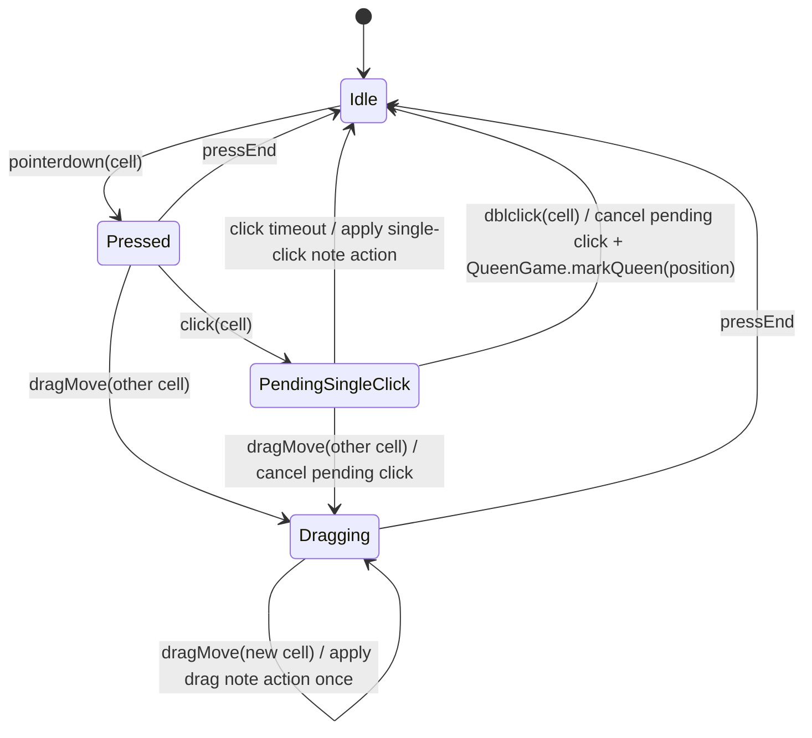

# Project Guide

This document explains how this project is organized, how game state flows through the app, and which conventions to follow when adding or changing features.

Use this as the default guide for new work. When a change touches multiple areas, prefer keeping the structure and naming consistent with the patterns described here instead of introducing a new local style.

Keep `README.md` focused on product overview, setup, usage, and high-level architecture. Small implementation conventions and team-facing coding notes should live in `AGENTS.md` or code-local comments instead of being added to the README.

For detailed state machines and transition tables, use [docs/state.md](./docs/state.md). Keep `AGENTS.md` focused on rules, placement guidance, and the shorter architectural summary.

When updating `README.md`, prioritize:

- game rules and player-facing behavior
- project setup and commands
- high-level architecture
- folder overview
- asset credits and license/source summaries

Avoid low-level implementation notes, temporary refactor guidance, or component-specific conventions in the README unless those details are necessary for someone to understand the project at a high level.

When adding or changing visual or audio assets, update the README asset credits if the source or license changes. Keep detailed implementation notes in `AGENTS.md` or code-local comments, but keep source and license summaries centralized in README.

## 1. Project Overview

This is a Vue 3 + Vite puzzle game based on the N-Queens problem. TypeScript is used across the codebase, Vue Router handles page navigation, and Vitest / Cypress cover automated testing.

The current product structure is page-driven:

- `HomeView`: landing page and game entry
- `GameView`: active puzzle screen

At a high level, most gameplay follows this flow:

1. A view under `src/views/` owns the screen-level flow.
2. Reusable UI is extracted into `src/components/`.
3. Core game rules live in `src/modules/game/`.
4. Shared type definitions live in `src/modules/types/`.
5. Puzzle data lives in `src/modules/puzzles/`.
6. Small cross-cutting helpers live in `src/modules/utils/`.

The key architectural rule is:

- UI components must not implement or mutate core game rules directly.
- `QueenGame` is the single place where game rules and result state should be decided.

Current interaction flow:

1. `GameCell` emits user intent.
2. `GameBoard` translates that intent into engine calls.
3. `QueenGame` applies the rules.
4. `BoardCell` instances reflect the resulting cell state.

## 2. Directory Guide

### `src/views/`

Views are route-level entry points. They should own:

- screen composition
- page-level actions such as starting, quitting, or requesting a hint
- coordination between router state, UI sections, and the game engine

They should not become dumping grounds for detailed board rendering logic. If a section starts carrying its own presentation behavior, extract it into `src/components/`.

Current examples:

- `src/views/HomeView.vue`
- `src/views/GameView.vue`

### `src/components/`

Components are reusable UI building blocks. Use feature folders when a set of components clearly belongs to one area of the game.

Current examples:

- `src/components/common/BaseButton.vue`
- `src/components/common/HeartCounter.vue`
- `src/components/game/GameBoard.vue`
- `src/components/game/GameCell.vue`

Component extraction is usually a good idea when:

- a template block is long enough to hide the page flow
- a UI block has its own props and rendering rules
- a section should read like a named domain concept

### `src/modules/game/`

This folder owns gameplay state and rules.

Responsibilities:

- create and reset boards
- track hearts and hint usage
- determine win / lose conditions
- update cell state through engine methods

Keep gameplay rules here rather than spreading them across Vue components.

Current examples:

- `src/modules/game/QueenGame.ts`
- `src/modules/game/BoardCell.ts`

`QueenGame` should remain the main entry point for rule changes. `BoardCell` should stay focused on individual cell state and simple cell-level transitions.

### `src/router/`

Router configuration belongs here.

Current route structure:

- `/` -> `HomeView`
- `/game` -> `GameView`

When adding a new page, define the route here and place the route component under `src/views/`.

### `src/modules/types/`

Put reusable TypeScript models and aliases here.

Current examples:

- `src/modules/types/board.ts`
- `src/modules/types/puzzle.ts`

Good fits:

- position tuples
- puzzle definitions
- public game-facing object shapes

If a type is only used inside one component or one class and is not part of a wider contract, keeping it local is acceptable.

### `src/modules/puzzles/`

Puzzle definitions belong here.

Responsibilities:

- define board regions
- define queen positions
- define per-puzzle rule flags when the puzzle variant needs them
- group puzzle sets by board size or difficulty when useful

Keep puzzle data declarative. Validation or gameplay logic should not live inside puzzle definition files.

Current puzzle shape notes:

- puzzle size should live in `puzzle.rules.size`
- current campaign puzzle size should not exceed `10`
- default campaign puzzles should keep `allowDisconnectedRegions: false`
- default campaign puzzles should keep `queensPerUnit: 1`
- if a future puzzle variant changes those flags, update validation and player-facing rule explanations together

### `src/modules/constants/`

Shared runtime constants belong here when they are used across modules or UI surfaces.

Current examples:

- `src/modules/constants/boardSkins.ts`

Board skin notes:

- board skins should define `BOARD_SKIN_COLOR_COUNT` palette colors
- `GameBoard` should derive board colors through `pickDistributedColors(...)`
- boards smaller than the palette size should still use colors spread across the full palette, including the first and last palette colors
- color-blind accessibility skins should pair color with non-color region cues instead of relying on hue alone
- board texture should remain an independent setting from board skin so players can combine any color palette with or without non-color region cues
- board texture patterns should use the fixed `CellTextureType` set and select the board's needed region textures from those enum values
- the `RING` texture enum value represents the ring pattern and should remain one of the available texture types, not only the disabled state
- keep pattern CSS definitions centralized in `src/assets/texture.module.scss`
- `CellTextureType` string values should exactly match the texture class names in `src/assets/texture.module.scss` so components can use the selected texture type directly as the class name
- rendering components should only map a region id to the already selected color and texture class

### `src/modules/utils/`

Utilities belong here when they are shared, pure, and not tied to rendering.

Current example:

- `src/modules/utils/random.ts`

Do not move tiny one-off logic into `utils/` too early. Keep implementation details local until reuse is real.

### `src/modules/stores/`

This folder is reserved for Pinia stores when shared app state is needed.

Right now, the main gameplay flow is driven by `QueenGame`, not by a store. Do not move core puzzle rules into Pinia unless there is a clear architectural reason.

If a store is introduced, use it for:

- cross-view UI state
- app-level preferences
- shared state that must outlive a single screen instance

## 3. Game Architecture

### Engine First

This project should preserve a clear boundary between the UI layer and the game engine.

Prefer this direction:

`UI -> intent -> QueenGame -> BoardCell state`

Avoid this direction:

`UI -> direct cell mutation -> scattered rule handling`

In practice, this means:

- `GameCell` should emit events that describe player actions
- `GameBoard` should wire those actions to engine methods
- `QueenGame` should decide whether hearts change, hints are consumed, or the game ends
- `BoardCell` should not become a second game engine

### `QueenGame`

`QueenGame` is the single source of truth for a running puzzle.

It should own:

- board creation
- heart tracking
- hint usage
- win / lose checks
- reset behavior

If a new gameplay rule is introduced, prefer adding or updating a method on `QueenGame` instead of implementing the rule inside a Vue component.

### `BoardCell`

`BoardCell` represents one square on the board.

It may own:

- row / column position
- region id
- whether the cell actually contains a queen
- local display-oriented status such as `empty`, `note`, `wrong`, or `found`

It should not decide broader game outcomes such as:

- remaining hearts
- whether a hint can still be used
- whether the game has been won or lost

### Views And Components

Views and components should focus on presentation and interaction flow.

Good fits for Vue files:

- rendering board and controls
- forwarding click / pointer events
- showing current hearts or hint availability
- triggering navigation

Poor fits for Vue files:

- deciding penalty rules
- resolving win conditions
- duplicating board validation logic

## 4. UI And Interaction Rules

Prefer components that express domain concepts clearly. If a template block represents a meaningful part of the game, give it a name and extract it instead of leaving it as anonymous markup inside a view.

For interaction handling:

- use emitted events from child components to describe user intent
- keep drag and pointer coordination in board-level UI code
- keep rule evaluation in the engine

When a UI event needs game-state changes beyond a trivial visual toggle, route it through `QueenGame`.

This rule is especially important for:

- queen marking
- wrong guesses and heart deduction
- hint consumption
- win / lose transitions

### Cell Interaction State Machine

The current board interaction model is easiest to reason about as a small state machine coordinated by `GameBoard`.

Use transition tables as the primary documentation format for stateful UI behavior. Mermaid diagrams are helpful as visual aids, but the table should remain the source of truth because it is easier to diff, review, and maintain in Git.

When writing Mermaid diagrams for this repository, prefer GitHub-safe labels. Avoid function-call notation such as `markNote()` inside Mermaid transition text; use simplified labels such as `markNote` and keep the exact method-style names in tables or prose.

When a feature gains meaningful state complexity, prefer documenting it in [docs/state.md](./docs/state.md) instead of overloading `README.md` or scattering the rules across comments.

| Current State | Platform | Event | Next State | Action |
| --- | --- | --- | --- | --- |
| `Idle` | desktop+mobile | `pointerdown(cell)` | `Pressed` | start pointer session and store start position |
| `Pressed` | desktop+mobile | `click(cell)` | `PendingSingleClick` | schedule delayed single-click note action |
| `Pressed` | desktop | `pointerenter(other cell)` | `Dragging` | cancel pending note if needed and begin drag selection using the start cell's note mode |
| `Pressed` | mobile | `touchmove(over other cell)` | `Dragging` | resolve touched cell from coordinates and begin drag selection using the start cell's note mode |
| `Pressed` | desktop | `pointerup` / `pointercancel` / `mouseleave` | `Idle` | end pointer session |
| `Pressed` | mobile | `touchend` / `touchcancel` / `pointercancel` | `Idle` | end pointer session |
| `PendingSingleClick` | desktop+mobile | `dblclick(cell)` | `Idle` | cancel pending note and mark queen |
| `PendingSingleClick` | desktop+mobile | click timeout | `Idle` | `QueenGame.removeNote(position)` if noted, otherwise `QueenGame.markNote(position)` |
| `PendingSingleClick` | desktop | `pointerenter(other cell)` | `Dragging` | cancel pending click and begin drag selection using the start cell's note mode |
| `PendingSingleClick` | mobile | `touchmove(over other cell)` | `Dragging` | cancel pending click and begin drag selection using the start cell's note mode |
| `Dragging` | desktop | `pointerenter(new cell)` | `Dragging` | apply the drag note action once per newly entered cell |
| `Dragging` | mobile | `touchmove(over new cell)` | `Dragging` | apply the drag note action once per newly touched cell from screen point |
| `Dragging` | desktop | `pointerup` / `pointercancel` / `mouseleave` | `Idle` | end drag session |
| `Dragging` | mobile | `touchend` / `touchcancel` / `pointercancel` | `Idle` | end drag session |

```mermaid
stateDiagram-v2
  [*] --> Idle

  Idle --> Pressed: pointerdown(cell)
  Pressed --> PendingSingleClick: click(cell)
  Pressed --> Dragging: dragMove(other cell)
  Pressed --> Idle: pressEnd

  PendingSingleClick --> Idle: click timeout / apply single-click note action
  PendingSingleClick --> Idle: dblclick(cell) / cancel pending click + QueenGame.markQueen(position)
  PendingSingleClick --> Dragging: dragMove(other cell) / cancel pending click

  Dragging --> Dragging: dragMove(new cell) / apply drag note action once
  Dragging --> Idle: pressEnd
```

Notes:

- `GameCell` emits raw interaction events and does not mutate board state directly.
- `GameBoard` resolves whether a gesture is a single click, a double click, or a drag session across desktop and mobile input.
- single click is intentionally delayed slightly so a following `dblclick` can cancel it cleanly
- on desktop, drag progression is driven by `pointerenter`
- on mobile, drag progression is driven by `touchmove`, and `GameBoard` resolves the touched cell from screen coordinates before reusing the same drag-selection logic
- drag sessions suppress the trailing click that browsers often emit on release
- note marking, note removal, and queen marking should flow through `QueenGame`, not through direct `BoardCell` mutation from the component
- single-click note actions may remove an existing note or add a missing note
- drag sessions choose one note action based on the start cell: starting from an empty cell only marks empty cells, while starting from a noted cell only removes existing notes
- when a state machine becomes central to feature behavior, add both a transition table and a compact Mermaid diagram to `docs/state.md`

User-facing copy should stay consistent across the app. When the project eventually adds localization, prefer centralizing translatable strings rather than hard-coding the same message in multiple components.

For `aria-label`, use short sentence-case action labels for icon-only or symbol-only controls. Describe what the control does rather than what it looks like, and do not include the control type such as "button" because assistive technology already announces it.

Good examples:

- `Open settings`
- `Previous level`
- `Next level`

### Reka UI Primitives

This project uses Reka UI for Vue-native, unstyled accessibility primitives. Reka was chosen because it brings the Radix-style primitive model to Vue without imposing a visual theme, which lets Queener keep its own game-specific look and feel.

Use Reka when a component needs complex interaction semantics that are easy to get wrong by hand, such as:

- dialog or alert dialog behavior
- focus trapping or focus restoration
- keyboard navigation across a composite widget
- ARIA roles and relationships for non-native controls
- portals, popovers, dropdowns, selects, tabs, switches, or similar app UI primitives
- outside interaction handling such as escape key and outside pointer/focus events

Prefer project-owned components and native HTML when the component is simple, display-oriented, or part of game-specific interaction:

- board and cell interactions should remain controlled by `GameBoard`, `GameCell`, and their gesture/state-machine code
- simple buttons, counters, icons, previews, and layout wrappers do not need Reka unless they gain non-trivial accessibility behavior
- domain-specific game pickers, such as the current `LevelPicker`, should keep their custom UI when native buttons and semantic labels are enough

Treat Reka as the behavior and accessibility layer for generic app controls. Keep visual styling in Queener components and SCSS so the UI framework supports the product instead of defining its personality.

## 5. Model And File Placement Rules

When deciding where a new shape or helper should live, use this quick guide:

- Route-level screen: `src/views/`
- Reusable UI block: `src/components/`
- Core gameplay rule or engine behavior: `src/modules/game/`
- Reusable type or interface: `src/modules/types/`
- Declarative puzzle data: `src/modules/puzzles/`
- Shared pure helper: `src/modules/utils/`
- Cross-view shared store: `src/modules/stores/`

Keep types or helpers inside a component file only when they are truly private to that file.

## 6. Testing Guidance

Prefer tests that validate gameplay behavior and user-visible outcomes.

Current testing setup includes:

- Vitest for unit tests
- Cypress for end-to-end tests

Prefer a layered testing strategy:

- use unit tests for game rules, puzzle validation, and other pure logic
- use component tests for UI interaction contracts and state coordination inside a component boundary
- use Cypress sparingly for a small number of high-value player flows

In this project, end-to-end tests are most valuable when they protect interaction contracts that are easy to break through event wiring changes, such as:

- starting a game from the home screen
- desktop board interactions such as single click, double click, and drag
- a few critical player-visible flows such as hint usage, win, or game over

Do not try to exhaustively test all gameplay rule combinations through Cypress. Prefer covering those combinations in `QueenGame` and other focused Vitest suites, where failures are faster, more precise, and easier to maintain.

Testing priorities:

- `QueenGame` rule correctness
- `BoardCell` state transitions
- key component interaction contracts
- critical player flows such as starting a game and interacting with the board

For engine and utility code, prefer focused unit tests.

For Vue components, prefer testing:

- emitted events
- prop-driven rendering
- visible behavior after interaction
- existing semantic hooks such as text, roles, labels, stable classes, or existing attributes before adding new `data-*` test selectors

When writing tests, avoid adding new `data-*` / dataset hooks unless the component does not already expose a stable selector through its existing API or markup. Reuse the selectors the component already has when practical.

For board interactions specifically:

- keep most gesture and interaction edge cases in Vitest component tests around `GameBoard`
- use Cypress to confirm a smaller set of real browser flows still works end-to-end
- avoid overloading Cypress with every timing edge case unless the bug only reproduces in a real browser

Avoid brittle assertions against:

- generated DOM structure that is not part of the feature contract
- incidental styling details
- framework internals

Use consistent naming for new tests. Prefer `*.test.ts` and `*.test.tsx` across the repository instead of `*.spec.*`.

Prefer colocated tests when practical. Put a test file next to the source file it covers rather than inside a separate `__tests__` directory unless there is a strong reason not to.

## 7. Commit Rules

Follow Conventional Commits for commit messages.

Format commit subjects as:

`<type>[optional scope]: <description>`

Use:

- `feat` for new user-facing functionality
- `fix` for bug fixes and behavior corrections
- `refactor` for structural improvements without behavior changes
- `test` for test updates
- `docs` for documentation changes
- `chore` for maintenance work

Keep the subject concise and imperative.

If an AI agent creates the commit, include a body that summarizes the concrete changes.

If an AI agent creates the commit, append a `Co-authored-by` trailer in this format:

`Co-authored-by: <tool> <model> <email>`

Example:

`Co-authored-by: Codex GPT-5.4 <noreply@openai.com>`

## 8. Working Style Expectations

When making changes in this repository:

- preserve the engine-first architecture unless there is a clear reason to change it
- prefer small, named components over long anonymous template blocks
- keep views focused on screen flow
- keep game rules centralized in `QueenGame`
- prefer solving TypeScript typing issues without `as` assertions when practical; use `as` only as a last resort when the type relationship is real but difficult to express cleanly
- avoid `any`; prefer explicit types, `unknown`, generics, or narrower utility types instead
- choose readability over clever abstraction
- avoid duplicating rule logic across multiple files

When a file starts growing large, pause and ask whether a clearly named component, helper, or engine method should be extracted.

If a new pattern is introduced, it should make the project easier for the next person to navigate, test, and extend.
