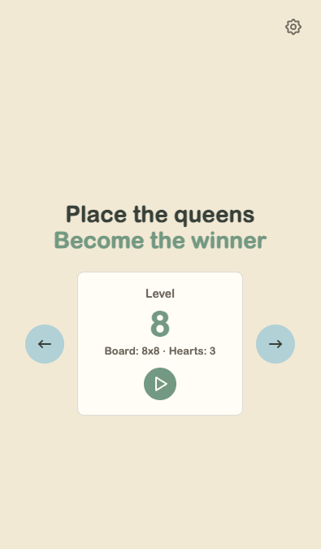
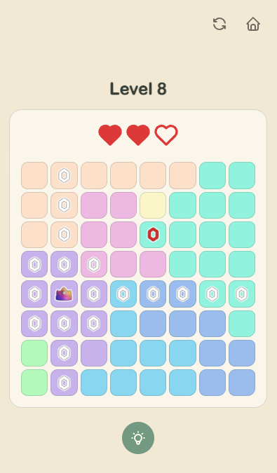
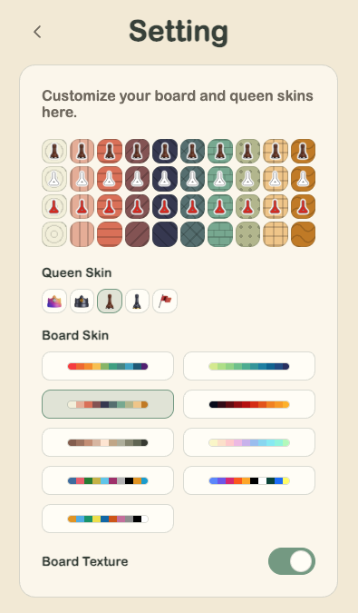

# Queener

Place the queens. Become the winner.

Queener is a puzzle-focused game inspired by the N-Queens problem. The project is now organized as a Bun workspace so the current web game can grow toward backend persistence, leaderboard records, replay features, and future app packaging without forcing every boundary too early.

## Screenshots

<p>
  
  
  
</p>

## Workspace

```text
queener/
  apps/
    web/       # Vue 3 + Vite game client
  docs/        # Product, architecture, state, and planning notes
```

The active application is [`apps/web`](./apps/web/README.md). Most gameplay and UI code still lives inside that app. Shared packages should be introduced only when another app or service actually needs the same code.

## Current Product

The current web app includes:

- a playable single-player Queener puzzle loop
- region-based N-Queens rules
- heart-based mistakes
- note marking, drag note marking, queen marking, and keyboard board controls
- per-run puzzle variants with board rotation and region remapping
- board skins, queen skins, board textures, and sound volume settings
- end-of-game replay and result flow
- asset preloading and responsive mobile-focused layout

For web-specific setup, scripts, and implementation details, see [`apps/web/README.md`](./apps/web/README.md).

## Development

Install workspace dependencies from the repository root:

```bash
bun install
```

Common root scripts:

```bash
bun run web:dev
bun run web:build
bun run web:lint
bun run web:type-check
bun run web:test:unit
bun run web:test:e2e
```

The web development server starts at `http://localhost:5173`.

## Documentation

- [Architecture](./docs/architecture.md): current workspace layout, app boundaries, and next architecture direction
- [Accessibility notes](./docs/a11y.md): keyboard layers, board controls, and shortcut-setting principles
- [Development plan](./docs/plan.md): product, platform, accessibility, and later-stage direction
- [Checklist](./docs/checklist.md): concrete unfinished tasks
- [State documentation](./docs/state.md): state machines and transition tables
- [Web app README](./apps/web/README.md): web app features, structure, and commands

## Resources And Licensing

Queener uses a small set of external visual and audio references. The goal is to keep the game playful while choosing resources that are clear enough for public project use.

- Board skin palettes are selected with color accessibility in mind. Most palettes are custom choices drafted with [Coolors](https://coolors.co/) and then adjusted through accessibility review, including color-distance checks for board readability. Some palette options are adapted from public color-blind safe palette references:
  - Paul Tol's color scheme work
  - IBM's color-blind safe palette
  - the Okabe-Ito / Bang Wong color-blind palette
- Queen icons and possible favicon directions may reference [3D Icons](https://3dicons.co/) or a similar colorful 3D icon style. 3D Icons describes its assets as CC0 / Creative Commons Zero, which is suitable for project artwork, but shared CC0 assets should not be treated as exclusive brand marks or registrable trademarks without further review.
- UI icons and the favicon direction use [Tabler Icons](https://tabler.io/icons), which are licensed under MIT.
- Sound effects come from [Pixabay](https://pixabay.com/) and are used under Pixabay's royalty-free content license.
