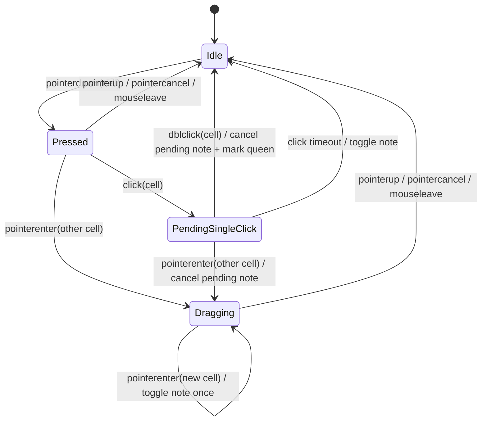
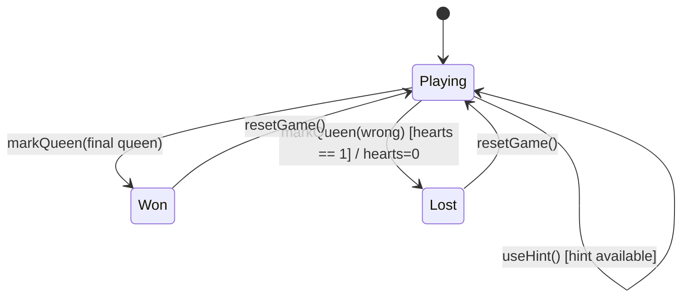
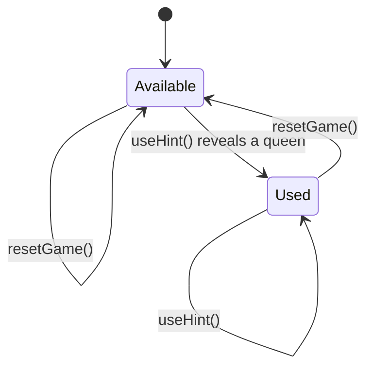
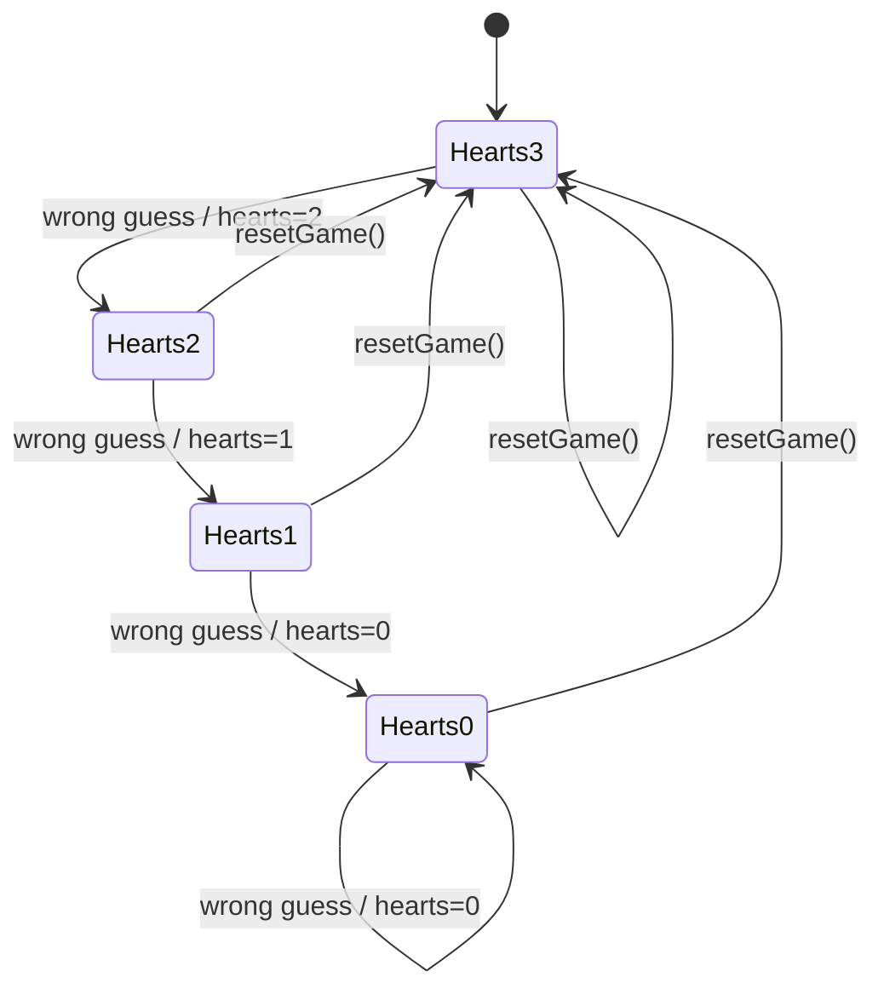

# State Documentation

This document collects the main state transitions used in the project.

Use transition tables as the primary format. Mermaid diagrams are included as compact visual aids, but the tables should remain the authoritative version because they are easier to review and update alongside code changes.

The project currently uses a mix of:

- finite state machines for discrete UI or object states
- orthogonal state dimensions for independent concerns such as hint usage
- derived state for conditions computed from existing values rather than stored as a dedicated enum

When documenting a stateful behavior, explicitly note which of those categories it belongs to.

Notation guidance:

- if a value is itself a discrete state, put it in the node
- if multiple concerns evolve independently, model them as separate or orthogonal state machines instead of collapsing everything into one large combined graph
- if a value is derived from other values, document the derivation and keep exact value changes in the transition table

## 1. Cell Interaction Session

This state machine describes how `GameBoard` interprets low-level pointer and click events coming from `GameCell`.

Type:

- finite state machine
- transient UI interaction state

Implementation:

- [src/components/game/GameBoard.vue](../src/components/game/GameBoard.vue)
- [src/components/game/GameCell.vue](../src/components/game/GameCell.vue)

### Transition Table

| Current State | Event | Next State | Action |
| --- | --- | --- | --- |
| `Idle` | `pointerdown(cell)` | `Pressed` | start pointer session and store start position |
| `Pressed` | `click(cell)` | `PendingSingleClick` | schedule delayed note toggle |
| `Pressed` | `pointerenter(other cell)` | `Dragging` | begin drag selection |
| `Pressed` | `pointerup` / `pointercancel` / `mouseleave` | `Idle` | end pointer session |
| `PendingSingleClick` | `dblclick(cell)` | `Idle` | cancel pending note and mark queen |
| `PendingSingleClick` | click timeout | `Idle` | call `QueenGame.toggleNote(position)` |
| `PendingSingleClick` | `pointerenter(other cell)` | `Dragging` | cancel pending click and begin drag selection |
| `Dragging` | `pointerenter(new cell)` | `Dragging` | toggle note once for each newly entered cell |
| `Dragging` | `pointerup` / `pointercancel` / `mouseleave` | `Idle` | end drag session |

### Mermaid



### Notes

- `GameCell` emits interaction intent only.
- `GameBoard` owns gesture interpretation.
- `QueenGame` performs the actual note and queen updates.
- The delayed single-click branch exists so a `dblclick` can cancel it cleanly.

## 2. BoardCell Status

This state machine describes the state of one cell on the board.

Type:

- finite state machine
- object-local state

Implementation:

- [src/game/BoardCell.ts](../src/game/BoardCell.ts)
- [src/game/QueenGame.ts](../src/game/QueenGame.ts)

### Transition Table

| Current State | Event | Next State | Action |
| --- | --- | --- | --- |
| `empty` | `toggleNote()` | `note` | show an `X` note |
| `note` | `toggleNote()` | `empty` | remove the note |
| `empty` | `markQueen()` on a queen cell | `found` | reveal the queen |
| `note` | `markQueen()` on a queen cell | `found` | replace note with a found queen |
| `empty` | `markQueen()` on a non-queen cell | `wrong` | mark the guess as wrong |
| `note` | `markQueen()` on a non-queen cell | `wrong` | replace note with wrong state |
| `found` | `markQueen()` | `found` | no-op |
| `wrong` | `markQueen()` | `wrong` | no-op |
| `found` | `toggleNote()` | `found` | no-op |
| `wrong` | `toggleNote()` | `wrong` | no-op |

### Mermaid

```mermaid
stateDiagram-v2
  [*] --> empty

  empty --> note: toggleNote()
  note --> empty: toggleNote()

  empty --> found: markQueen() on queen cell
  note --> found: markQueen() on queen cell

  empty --> wrong: markQueen() on non-queen cell
  note --> wrong: markQueen() on non-queen cell

  found --> found: markQueen()
  found --> found: toggleNote()
  wrong --> wrong: markQueen()
  wrong --> wrong: toggleNote()
```

### Notes

- `BoardCell` stores cell-local state only.
- `BoardCell` does not know about hearts, hints, win conditions, or game-over state.
- `found` and `wrong` are terminal cell states in the current implementation.

## 3. Game Session State

This state is currently best described as derived game-session state rather than a dedicated stored enum.

Type:

- derived state
- session-level state

Implementation:

- [src/game/QueenGame.ts](../src/game/QueenGame.ts)
- [src/components/game/GameBoard.vue](../src/components/game/GameBoard.vue)
- [src/views/GameView.vue](../src/views/GameView.vue)

The current code computes this state from other values instead of storing it explicitly:

- hearts remaining
- whether all queens are found
- whether hint usage has changed

Modeling note:

- `Playing`, `Won`, and `Lost` are the high-level session states
- hint availability is a separate orthogonal state machine documented below
- exact value updates such as heart loss or revealed queen count stay in the transition table instead of being expanded into many combined Mermaid nodes

### Derived Conditions

| Derived State | Condition |
| --- | --- |
| `Playing` | `hearts > 0` and not all queens are found |
| `Won` | all queens are found |
| `Lost` | `hearts <= 0` |

### Transition Table

| Current State | Event | Next State | Context Change | Action |
| --- | --- | --- | --- | --- |
| `Playing` | `markQueen(correct cell)` and not all queens found | `Playing` | found queens `n -> n + 1` | reveal queen |
| `Playing` | `markQueen(correct final queen)` | `Won` | found queens `N - 1 -> N` | reveal final queen |
| `Playing` | `markQueen(wrong cell)` and hearts remain | `Playing` | hearts `n -> n - 1` | decrement hearts |
| `Playing` | `markQueen(wrong cell)` and hearts reach `0` | `Lost` | hearts `1 -> 0` | decrement hearts and trigger loss UI flow |
| `Playing` | `useHint()` with hint available | `Playing` | hint state `Available -> Used`; found queens `n -> n + 1` | reveal one queen and mark hint as used |
| `Playing` | `resetGame()` | `Playing` | hearts `current -> 3`; hint state `current -> Available`; found queens `current -> 0` | rebuild board, reset session values |
| `Won` | `resetGame()` | `Playing` | hearts `current -> 3`; hint state `current -> Available`; found queens `current -> 0` | start a fresh game |
| `Lost` | `resetGame()` | `Playing` | hearts `current -> 3`; hint state `current -> Available`; found queens `current -> 0` | start a fresh game |

### Mermaid



### Notes

- `Won` and `Lost` are currently derived from `QueenGame.isWin()` and `QueenGame.isGameOver()`.
- The current UI only partially expresses these states. Loss has an alert-based flow today, while win-state presentation is still incomplete.
- If the project adds richer overlays, restart flow, score tracking, or progression, consider introducing an explicit game-session state enum or a fuller extended state machine.

## 4. Hint Availability

Hint usage is simple today, but documenting it separately helps keep future UI changes honest.

Type:

- finite state machine
- orthogonal state dimension

Implementation:

- [src/game/QueenGame.ts](../src/game/QueenGame.ts)
- [src/views/GameView.vue](../src/views/GameView.vue)

### Transition Table

| Current State | Event | Next State | Value Change | Action |
| --- | --- | --- | --- | --- |
| `Available` | `useHint()` with unfound queens remaining | `Used` | `hintUsed: false -> true` | reveal one queen |
| `Available` | `useHint()` with no remaining queens | `Available` | `hintUsed: false -> false` | return `null` |
| `Used` | `useHint()` | `Used` | `hintUsed: true -> true` | return `null` |
| `Available` | `resetGame()` | `Available` | `hintUsed: false -> false` | no change from fresh state |
| `Used` | `resetGame()` | `Available` | `hintUsed: true -> false` | restore hint availability |

### Mermaid



### Notes

- Hint availability is currently represented by `QueenGame.isHintUsed()`.
- Hint state is independent from hearts, but it still participates in the broader game-session flow.
- This is a good example of an orthogonal state dimension: the hint can change from available to used while the broader game session still remains in `Playing`.

## 5. Combined Modeling View

For this project, the recommended mental model is:

- one high-level session state machine for `Playing`, `Won`, and `Lost`
- one separate hint state machine for `Available` and `Used`
- cell-local state machines for each `BoardCell`

This avoids state explosion. For example, we deliberately do not expand the game into combined nodes such as:

- `Playing + HintAvailable + Hearts3`
- `Playing + HintUsed + Hearts2`
- `Lost + HintUsed + Hearts0`

Those combinations are real runtime situations, but they are better represented here as:

- a main state node
- one or more orthogonal state machines
- explicit value changes in the transition tables

## 6. Hearts Counter

Hearts are currently modeled as a bounded value rather than a named enum, but they still behave like a small finite state machine.

Type:

- finite state machine
- bounded numeric resource state

Implementation:

- [src/game/QueenGame.ts](../src/game/QueenGame.ts)
- [src/components/game/GameBoard.vue](../src/components/game/GameBoard.vue)
- [src/components/common/HeartCounter.vue](../src/components/common/HeartCounter.vue)

### Transition Table

| Current State | Event | Next State | Value Change | Action |
| --- | --- | --- | --- | --- |
| `3 Hearts` | `markQueen(wrong cell)` | `2 Hearts` | `3 -> 2` | decrement hearts |
| `2 Hearts` | `markQueen(wrong cell)` | `1 Heart` | `2 -> 1` | decrement hearts |
| `1 Heart` | `markQueen(wrong cell)` | `0 Hearts` | `1 -> 0` | decrement hearts and enter loss condition |
| `0 Hearts` | `markQueen(wrong cell)` | `0 Hearts` | `0 -> 0` | remain at zero |
| `3 Hearts` | `resetGame()` | `3 Hearts` | `3 -> 3` | restore fresh state |
| `2 Hearts` | `resetGame()` | `3 Hearts` | `2 -> 3` | restore fresh state |
| `1 Heart` | `resetGame()` | `3 Hearts` | `1 -> 3` | restore fresh state |
| `0 Hearts` | `resetGame()` | `3 Hearts` | `0 -> 3` | restore fresh state |

### Mermaid



### Notes

- Hearts are currently stored as a number on `QueenGame`, but the reachable values are bounded and discrete in normal gameplay.
- `0 Hearts` is the value-level condition that drives the higher-level `Lost` derived state.
- If the game later adds healing, extra lives, difficulty settings, or different heart caps, this section should be updated first.
