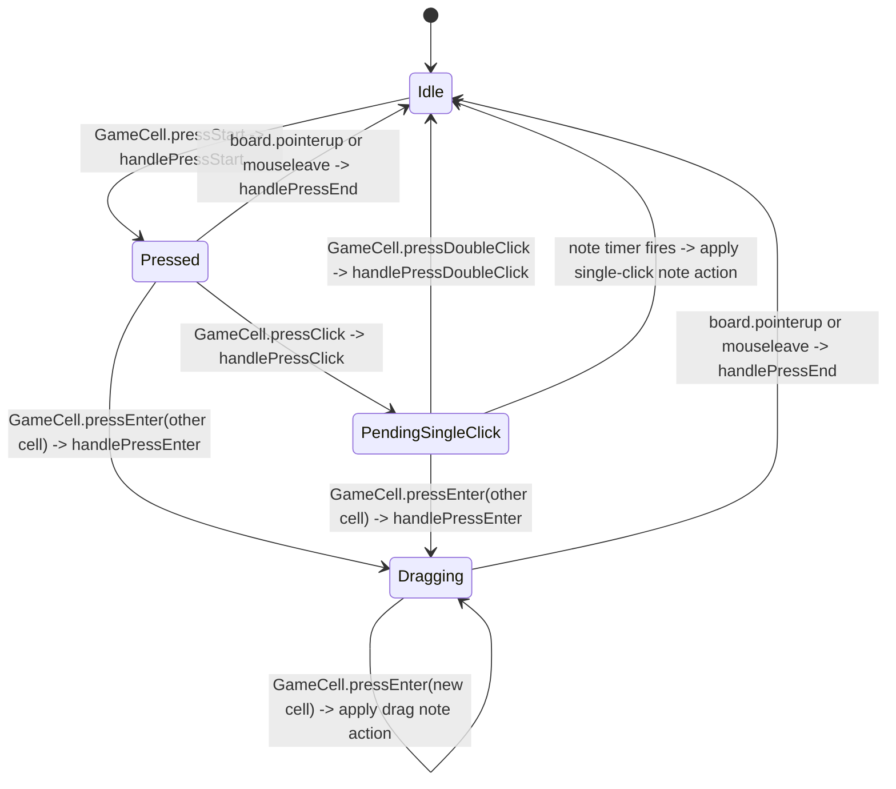
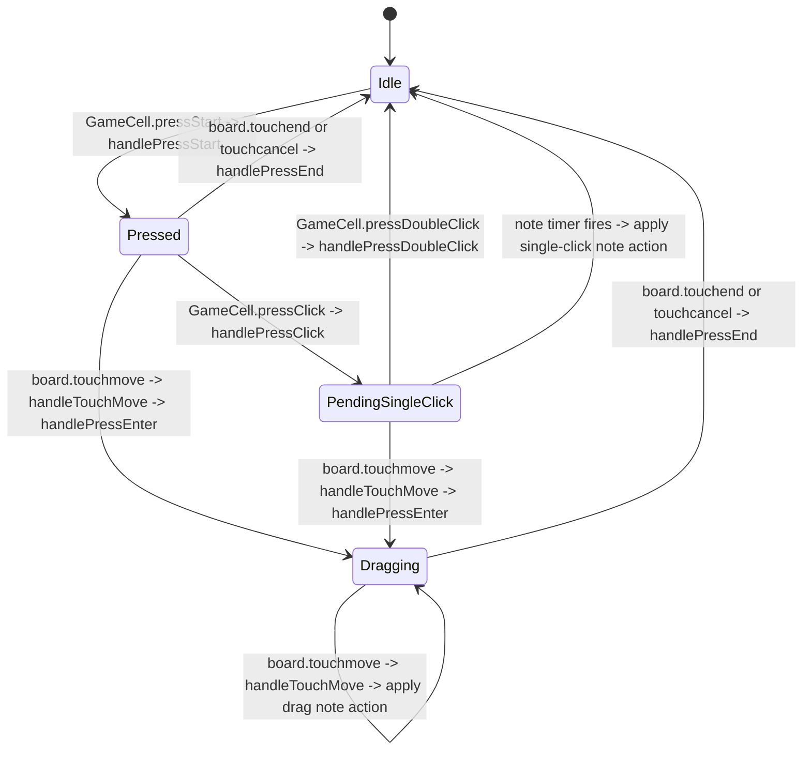
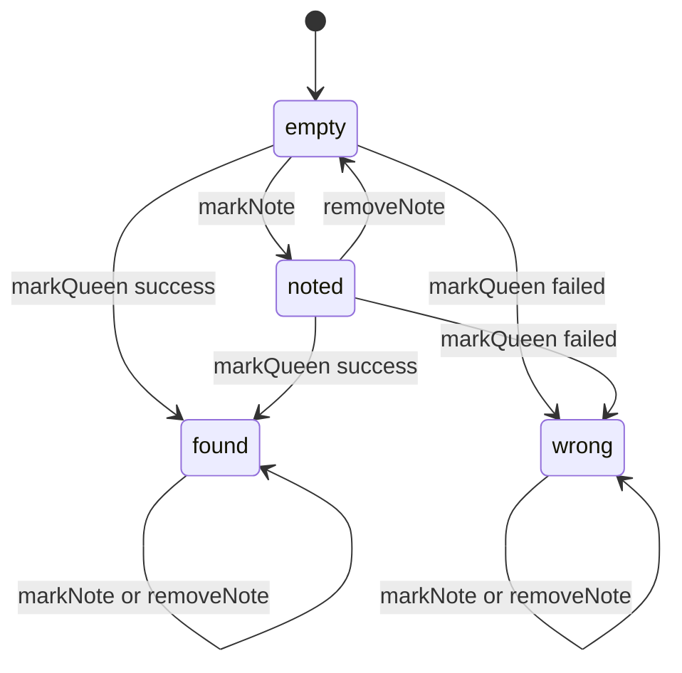
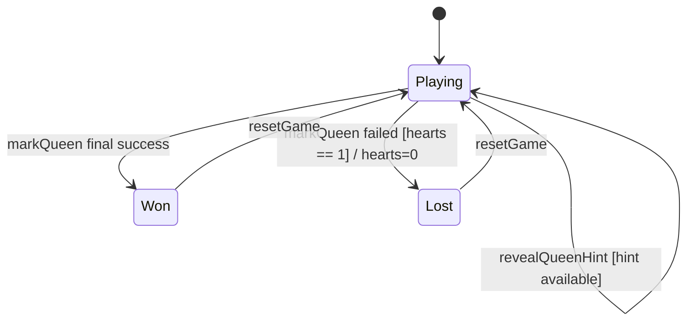
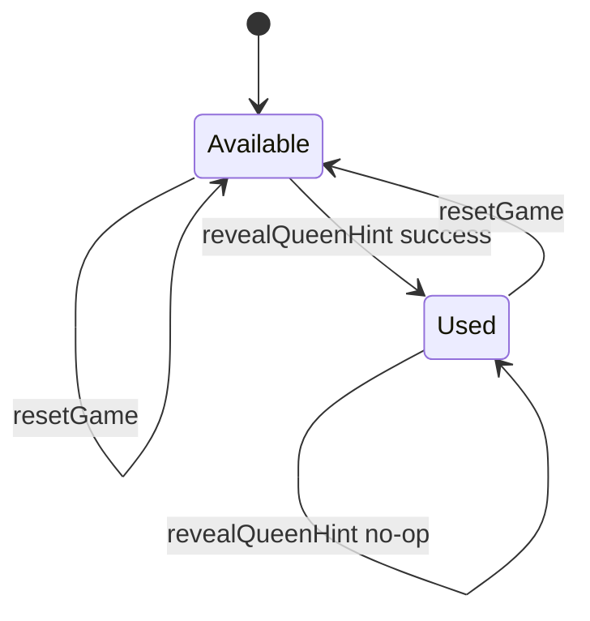
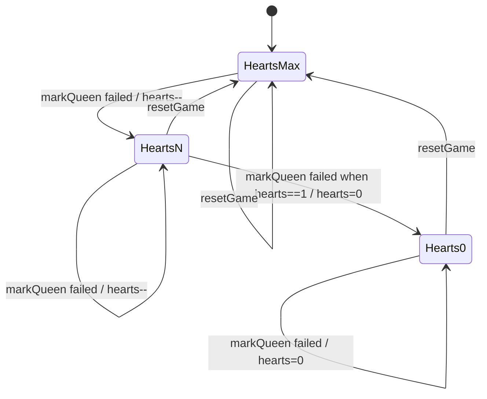

# State Documentation

This document collects the main state transitions used in the project.

> Transition tables are the primary source of truth. State flowcharts are included as compact visual aids.
>
> To keep these flowcharts renderable on GitHub, labels in this document stay conservative. Prefer simplified labels such as `markNote` in diagrams, and keep exact method-style names in tables or prose when needed. Also avoid reserved words such as `note` as raw state node names.

## 1. Cell Interaction Session

This state machine describes how `GameBoard` interprets low-level pointer, touch, and keyboard interaction events coming from `GameCell` and the board container.

Type:

- finite state machine
- transient UI interaction state

Implementation:

- [apps/web/src/components/game/GameBoard.vue](../apps/web/src/components/game/GameBoard.vue)
- [apps/web/src/components/game/GameCell.vue](../apps/web/src/components/game/GameCell.vue)
- [apps/web/src/components/game/gameInputEvents.ts](../apps/web/src/components/game/gameInputEvents.ts)
- [apps/web/src/components/game/useGameCellInputEvents.ts](../apps/web/src/components/game/useGameCellInputEvents.ts)
- [apps/web/src/components/game/useGameBoardInputEvents.ts](../apps/web/src/components/game/useGameBoardInputEvents.ts)
- [apps/web/src/components/game/useGameBoardGestures.ts](../apps/web/src/components/game/useGameBoardGestures.ts)

### Input Event Mapping

`GameCell` normalizes cell-level input into press-oriented business events before `GameBoard` interprets gameplay behavior.

| Business Event | Touch Input | Mouse Input | Keyboard Input | Emitted Intent |
| -------------- | ----------- | ----------- | -------------- | -------------- |
| press start | touch press through `pointerdown` | `pointerdown` | `Space keydown` | `pressStart(position)` |
| press | synthesized tap `click` | `click` | `Space keyup` | `pressClick(position)` |
| double press | synthesized double tap `dblclick` when available | `dblclick` | second Space press before the note timeout | `pressDoubleClick(position)` or `pressClick(position)` resolving as double press |
| press enter | active touch resolved by board `touchmove` | `pointerenter` | focus enters another cell while Space is held | `pressEnter(position)` |
| press end | `touchend` / `touchcancel` | `pointerup` / `pointercancel` / `mouseleave` | `Space keyup` after a drag | `pressEnd()` |
| focus move | not used | not used | arrow keydown | `moveFocus(position, direction)` |

`GameBoard` normalizes board-level input and focus movement before passing events to the gesture state machine.

| Business Event | Touch Input | Mouse Input | Keyboard Input | Handler |
| -------------- | ----------- | ----------- | -------------- | ------- |
| press end | `touchend` / `touchcancel` | `pointerup` / `pointercancel` / `mouseleave` | Space keyup forwarded from `GameCell` | `handlePressEnd()` |
| press move | `touchmove` resolved with `document.elementFromPoint(...)` | cell `pointerenter` forwarded from `GameCell` | focus entering a cell while Space is held | `handlePressEnter(position)` |
| focus move | not used | not used | arrow keydown forwarded from `GameCell` | `moveFocus(position, direction)` |

### Transition Table

| Current State        | Platform    | Event                                                   | Next State           | Action                                                          |
| -------------------- | ----------- | ------------------------------------------------------- | -------------------- | --------------------------------------------------------------- |
| `Idle`               | pointer+touch | `pointerdown(cell)`                                    | `Pressed`            | start press session and store start position                    |
| `Idle`               | keyboard    | `Space keydown(cell)`                                   | `Pressed`            | start press session and store start position                    |
| `Pressed`            | pointer+touch | `click(cell)`                                          | `PendingSingleClick` | schedule delayed single-click note action                       |
| `Pressed`            | keyboard    | `Space keyup(cell)`                                     | `PendingSingleClick` | schedule delayed single-click note action                       |
| `Pressed`            | desktop     | `pointerenter(other cell)`                              | `Dragging`           | cancel pending note if needed and begin drag selection using the start cell's note mode |
| `Pressed`            | mobile      | `touchmove(over other cell)`                            | `Dragging`           | resolve touched cell from coordinates and begin drag selection using the start cell's note mode |
| `Pressed`            | keyboard    | `focus(other cell)` while Space is held                  | `Dragging`           | cancel pending note if needed and begin drag selection using the start cell's note mode |
| `Pressed`            | desktop     | `pointerup` / `pointercancel` / `mouseleave`            | `Idle`               | end press session                                               |
| `Pressed`            | mobile      | `touchend` / `touchcancel` / `pointercancel`            | `Idle`               | end press session                                               |
| `Pressed`            | keyboard    | `Space keyup` after drag                                | `Idle`               | end keyboard press session                                      |
| `PendingSingleClick` | pointer+touch | `dblclick(cell)`                                      | `Idle`               | cancel pending note and mark queen                              |
| `PendingSingleClick` | keyboard    | second `Space keyup(cell)` before timeout                | `Idle`               | cancel pending note and mark queen                              |
| `PendingSingleClick` | pointer+touch+keyboard | click timeout                                  | `Idle`               | call `QueenGame.removeNote(position)` if noted, otherwise `QueenGame.markNote(position)` |
| `PendingSingleClick` | desktop     | `pointerenter(other cell)`                              | `Dragging`           | cancel pending click and begin drag selection using the start cell's note mode |
| `PendingSingleClick` | mobile      | `touchmove(over other cell)`                            | `Dragging`           | cancel pending click and begin drag selection using the start cell's note mode |
| `PendingSingleClick` | keyboard    | `focus(other cell)` while Space is held                  | `Dragging`           | cancel pending click and begin drag selection using the start cell's note mode |
| `Dragging`           | desktop     | `pointerenter(new cell)`                                | `Dragging`           | apply the drag note action once for each newly entered cell     |
| `Dragging`           | mobile      | `touchmove(over new cell)`                              | `Dragging`           | apply the drag note action once for each newly touched cell from screen point |
| `Dragging`           | keyboard    | `focus(new cell)` while Space is held                    | `Dragging`           | apply the drag note action once for each newly focused cell     |
| `Dragging`           | desktop     | `pointerup` / `pointercancel` / `mouseleave`            | `Idle`               | end drag session                                                |
| `Dragging`           | mobile      | `touchend` / `touchcancel` / `pointercancel`            | `Idle`               | end drag session                                                |
| `Dragging`           | keyboard    | `Space keyup`                                           | `Idle`               | end drag session                                                |

### Desktop Flowchart


```mermaid
stateDiagram-v2
  [*] --> Idle

  Idle --> Pressed: GameCell.pressStart -> handlePressStart
  Pressed --> PendingSingleClick: GameCell.pressClick -> handlePressClick
  Pressed --> Dragging: GameCell.pressEnter(other cell) -> handlePressEnter
  Pressed --> Idle: board.pointerup or mouseleave -> handlePressEnd

  PendingSingleClick --> Idle: GameCell.pressDoubleClick -> handlePressDoubleClick
  PendingSingleClick --> Idle: note timer fires -> apply single-click note action
  PendingSingleClick --> Dragging: GameCell.pressEnter(other cell) -> handlePressEnter

  Dragging --> Dragging: GameCell.pressEnter(new cell) -> apply drag note action
  Dragging --> Idle: board.pointerup or mouseleave -> handlePressEnd
```

### Mobile Flowchart


```mermaid
stateDiagram-v2
  [*] --> Idle

  Idle --> Pressed: GameCell.pressStart -> handlePressStart
  Pressed --> PendingSingleClick: GameCell.pressClick -> handlePressClick
  Pressed --> Dragging: board.touchmove -> handleTouchMove -> handlePressEnter
  Pressed --> Idle: board.touchend or touchcancel -> handlePressEnd

  PendingSingleClick --> Idle: GameCell.pressDoubleClick -> handlePressDoubleClick
  PendingSingleClick --> Idle: note timer fires -> apply single-click note action
  PendingSingleClick --> Dragging: board.touchmove -> handleTouchMove -> handlePressEnter

  Dragging --> Dragging: board.touchmove -> handleTouchMove -> apply drag note action
  Dragging --> Idle: board.touchend or touchcancel -> handlePressEnd
```

### Function Mapping

| Source | Event | Handler / Function Chain | Responsibility |
| ------ | ----- | ------------------------ | -------------- |
| `GameCell` | `pointerdown` or `Space keydown` | `pressStart` -> `handlePressStart(position)` | start a shared press session and remember the drag start cell |
| `GameCell` | `click` or `Space keyup` | `pressClick` -> `handlePressClick(position)` | schedule a note action or mark queen on a second press before timeout |
| `GameCell` | `dblclick` | `pressDoubleClick` -> `handlePressDoubleClick(position)` -> `QueenGame.markQueen(position)` | cancel pending note and mark a queen |
| `GameCell` | `pointerenter` or focus while Space is held | `pressEnter` -> `handlePressEnter(position)` | drive drag progression from pointer or keyboard input |
| `GameCell` | arrow keydown | `focusCell(position, direction)` | move focus to the next cell in that direction |
| `.game-board` native listeners | `touchmove` | `handleTouchMove(event)` -> `getPositionFromPoint(...)` -> `handlePressEnter(position)` | drive mobile drag progression by resolving the touched cell from screen coordinates |
| `.game-board` native listeners | `pointerup` / `pointercancel` / `mouseleave` / `touchend` / `touchcancel` | `handlePressEnd()` -> `resetPressSession()` | finish the current press or drag session |

### Notes

- `GameCell` converts pointer and keyboard input into shared cell-level press intent.
- `GameBoard` owns gesture interpretation for pointer, touch, and keyboard input.
- `QueenGame` performs the actual note and queen updates.
- Single click uses `QueenGame.isNote(position)` to choose `removeNote(position)` or `markNote(position)`.
- Space single press uses the same delayed single-click note branch.
- Space double press cancels the delayed note branch and marks a queen, matching mouse double click.
- Arrow keys move focus only; they do not change `QueenGame` state by themselves.
- Found and wrong cells remain focusable, but press actions on them are ignored.
- Dragging chooses one note action for the whole drag session based on the start cell.
- When dragging starts from an empty cell, dragging calls `QueenGame.markNote(position)` only; existing notes are not removed while sliding across them.
- When dragging starts from a noted cell, dragging calls `QueenGame.removeNote(position)` only; empty cells are not marked while sliding across them.
- The delayed single-click branch exists so a `dblclick` can cancel it cleanly.
- On desktop, drag progression is driven by `pointerenter`.
- On mobile, drag progression is driven by `touchmove`, and `GameBoard` resolves the active cell with `document.elementFromPoint(...)` before reusing the same drag-selection logic.
- On keyboard, drag progression is driven by focus entering another cell while Space is held.
- The shared `Dragging` state intentionally hides the input-source difference so note marking rules stay identical across devices.

## 2. BoardCell Status

This state machine describes the state of one cell on the board.

Type:

- finite state machine
- object-local state

Implementation:

- [apps/web/src/modules/game/BoardCell.ts](../apps/web/src/modules/game/BoardCell.ts)
- [apps/web/src/modules/game/QueenGame.ts](../apps/web/src/modules/game/QueenGame.ts)

### Transition Table

| Current State | Event                             | Next State | Action                          |
| ------------- | --------------------------------- | ---------- | ------------------------------- |
| `empty`       | `markNote()`                      | `note`     | show an `X` note                |
| `note`        | `removeNote()`                    | `empty`    | remove the note                 |
| `empty`       | `markQueen()` on a queen cell     | `found`    | reveal the queen                |
| `note`        | `markQueen()` on a queen cell     | `found`    | replace note with a found queen |
| `empty`       | `markQueen()` on a non-queen cell | `wrong`    | mark the guess as wrong         |
| `note`        | `markQueen()` on a non-queen cell | `wrong`    | replace note with wrong state   |
| `found`       | `markQueen()`                     | `found`    | no-op                           |
| `wrong`       | `markQueen()`                     | `wrong`    | no-op                           |
| `found`       | `markNote()` / `removeNote()`     | `found`    | no-op                           |
| `wrong`       | `markNote()` / `removeNote()`     | `wrong`    | no-op                           |

### State Flowchart


```mermaid
stateDiagram-v2
  [*] --> empty

  empty --> noted: markNote
  noted --> empty: removeNote

  empty --> found: markQueen success
  noted --> found: markQueen success

  empty --> wrong: markQueen failed
  noted --> wrong: markQueen failed

  found --> found: markQueen
  found --> found: markNote or removeNote
  wrong --> wrong: markQueen
  wrong --> wrong: markNote or removeNote
```

### Notes

- `BoardCell` stores cell-local state only.
- `BoardCell` does not know about hearts, hints, win conditions, or game-over state.
- `found` and `wrong` are terminal cell states in the current implementation.

## 3. Game Session State

This state is currently best described as derived game-session state rather than a dedicated stored enum.

Type:

- derived state
- session-level state

Implementation:

- [apps/web/src/modules/game/QueenGame.ts](../apps/web/src/modules/game/QueenGame.ts)
- [apps/web/src/components/game/GameBoard.vue](../apps/web/src/components/game/GameBoard.vue)
- [apps/web/src/views/GameView.vue](../apps/web/src/views/GameView.vue)

The current code computes this state from other values instead of storing it explicitly:

- hearts remaining
- whether all queens are found
- whether hint usage has changed

Modeling note:

- `Playing`, `Won`, and `Lost` are the high-level session states
- hint availability is a separate orthogonal state machine documented below
- exact value updates such as heart loss or revealed queen count stay in the transition table instead of being expanded into many combined flowchart nodes

### Derived Conditions

| Derived State | Condition                                 |
| ------------- | ----------------------------------------- |
| `Playing`     | `hearts > 0` and not all queens are found |
| `Won`         | all queens are found                      |
| `Lost`        | `hearts <= 0`                             |

### Transition Table

| Current State | Event                                              | Next State | Context Change                                                                        | Action                                    |
| ------------- | -------------------------------------------------- | ---------- | ------------------------------------------------------------------------------------- | ----------------------------------------- |
| `Playing`     | `markQueen(correct cell)` and not all queens found | `Playing`  | found queens `n -> n + 1`                                                             | reveal queen                              |
| `Playing`     | `markQueen(correct final queen)`                   | `Won`      | found queens `N - 1 -> N`                                                             | reveal final queen                        |
| `Playing`     | `markQueen(wrong cell)` and hearts remain          | `Playing`  | hearts `n -> n - 1`                                                                   | decrement hearts                          |
| `Playing`     | `markQueen(wrong cell)` and hearts reach `0`       | `Lost`     | hearts `1 -> 0`                                                                       | decrement hearts and trigger loss UI flow |
| `Playing`     | `revealQueenHint()` with hint available                    | `Playing`  | hint state `Available -> Used`; found queens `n -> n + 1`                             | reveal one queen and mark hint as used    |
| `Playing`     | `resetGame()`                                      | `Playing`  | hearts `current -> maxHearts`; hint state `current -> Available`; found queens `current -> 0` | rebuild board, reset session values       |
| `Won`         | `resetGame()`                                      | `Playing`  | hearts `current -> maxHearts`; hint state `current -> Available`; found queens `current -> 0` | start a fresh game                        |
| `Lost`        | `resetGame()`                                      | `Playing`  | hearts `current -> maxHearts`; hint state `current -> Available`; found queens `current -> 0` | start a fresh game                        |

### State Flowchart


```mermaid
stateDiagram-v2
  [*] --> Playing

  Playing --> Playing: markQueen success / foundQueens++
  Playing --> Playing: markQueen failed [hearts > 1] / hearts--
  Playing --> Playing: revealQueenHint [hint available]
  Playing --> Won: markQueen final success
  Playing --> Lost: markQueen failed [hearts == 1] / hearts=0

  Won --> Playing: resetGame
  Lost --> Playing: resetGame
```

### Notes

- `Won` and `Lost` are currently derived from `QueenGame.isWin()` and `QueenGame.isGameOver()`.
- The current UI resolves both `Won` and `Lost` through the global modal flow with explicit next actions.
- If the project adds richer overlays, restart flow, score tracking, or progression, consider introducing an explicit game-session state enum or a fuller extended state machine.

## 4. Hint Availability

Hint usage is simple today, but documenting it separately helps keep future UI changes honest.

Type:

- finite state machine
- orthogonal state dimension

Implementation:

- [apps/web/src/modules/game/QueenGame.ts](../apps/web/src/modules/game/QueenGame.ts)
- [apps/web/src/views/GameView.vue](../apps/web/src/views/GameView.vue)

### Transition Table

| Current State | Event                                     | Next State  | Value Change               | Action                     |
| ------------- | ----------------------------------------- | ----------- | -------------------------- | -------------------------- |
| `Available`   | `revealQueenHint()` with unfound queens remaining | `Used`      | `hintUsed: false -> true`  | reveal one queen           |
| `Available`   | `revealQueenHint()` with no remaining queens      | `Available` | `hintUsed: false -> false` | return `null`              |
| `Used`        | `revealQueenHint()`                               | `Used`      | `hintUsed: true -> true`   | return `null`              |
| `Available`   | `resetGame()`                             | `Available` | `hintUsed: false -> false` | no change from fresh state |
| `Used`        | `resetGame()`                             | `Available` | `hintUsed: true -> false`  | restore hint availability  |

### State Flowchart


```mermaid
stateDiagram-v2
  [*] --> Available
  Available --> Used: revealQueenHint success
  Available --> Available: revealQueenHint no-op
  Used --> Used: revealQueenHint no-op
  Used --> Available: resetGame
  Available --> Available: resetGame
```

### Notes

- Hint availability is currently represented by `QueenGame.isHintUsed()`.
- Hint state is independent from hearts, but it still participates in the broader game-session flow.
- This is a good example of an orthogonal state dimension: the hint can change from available to used while the broader game session still remains in `Playing`.

## 5. Run Event Log

The run event log records selected state transitions that happen during one active puzzle run. It is runtime memory today and is intended to become the input for scoring, end-of-game replay, and local leaderboard storage.

Type:

- event log
- transition history

Implementation:

- [apps/web/src/modules/enums/ActionType.ts](../apps/web/src/modules/enums/ActionType.ts)
- [apps/web/src/modules/types/run.ts](../apps/web/src/modules/types/run.ts)
- [apps/web/src/modules/game/QueenGameRunRecorder.ts](../apps/web/src/modules/game/QueenGameRunRecorder.ts)
- [apps/web/src/modules/game/QueenGameRunReplay.ts](../apps/web/src/modules/game/QueenGameRunReplay.ts)
- [apps/web/src/views/useGameRun.ts](../apps/web/src/views/useGameRun.ts)

### Recorded Transitions

| Source State / Event | Resulting State Change | Recorded Action |
| --- | --- | --- |
| `BoardCell.empty` + successful `markNote()` | `empty -> note` | `ActionType.MARK_NOTE` |
| `BoardCell.note` + successful `removeNote()` | `note -> empty` | `ActionType.REMOVE_NOTE` |
| interactive `markQueen(correct cell)` | `empty/note -> found` | `ActionType.MARK_QUEEN` |
| interactive `markQueen(wrong cell)` | `empty/note -> wrong` | `ActionType.MARK_QUEEN` |
| `Hint Availability.Available` + successful `revealQueenHint()` | `Available -> Used`; one queen cell becomes `found` | `ActionType.HINT` |

### Non-Recorded Transitions

| Source State / Event | Reason |
| --- | --- |
| note or queen attempts on `found` / `wrong` cells | locked cells are no longer interactive in the UI |
| `revealQueenHint()` after the hint has already been used | no state change occurs |
| route changes, restarts, and result-modal actions | these start or end runs but are not player board actions |
| sound playback and modal display | presentation side effects, not game-state transitions |

### Action Record

Each player action record is stored with a run-relative timestamp and the target board position:

| Field | Type | Meaning |
| --- | --- | --- |
| `action` | `ActionType` | the player action that was applied |
| `actionAtMillisecond` | `number` | milliseconds elapsed since the current run recorder was created |
| `position` | `Position` | `[row, column]` for the affected board cell |

Current action values:

| Action Type | Value | Recorded When |
| --- | --- | --- |
| `ActionType.MARK_NOTE` | `mark-note` | a cell successfully changes from `empty` to `note` |
| `ActionType.REMOVE_NOTE` | `remove-note` | a cell successfully changes from `note` to `empty` |
| `ActionType.MARK_QUEEN` | `mark-queen` | the player attempts to mark a queen on an interactive cell |
| `ActionType.HINT` | `hint` | a hint successfully reveals a queen |

### Completed Run Record

A completed run record is the planned storage shape for leaderboard and replay data:

| Field | Type | Meaning |
| --- | --- | --- |
| `uid` | `string` | unique id for this completed run |
| `level` | `number` | campaign level number |
| `puzzle` | `Puzzle` | original puzzle source data, not the transformed active board |
| `puzzleVariantMetadata` | `PuzzleVariantMetadata` | per-run direction and region remap used to build the active board |
| `record` | `RunActionRecord[]` | ordered player action log |
| `startedAt` | `Date` | wall-clock run start time |
| `endedAt` | `Date` | wall-clock run end time |
| `user` | `RunUser` | user identity used for leaderboard display |
| `score` | `number` | calculated score for leaderboard sorting |

### Puzzle Variant Metadata

Puzzle variants are stored as metadata instead of a full transformed puzzle:

| Field | Type | Meaning |
| --- | --- | --- |
| `direction` | `0 | 90 | 180 | 270` | board rotation used for this run |
| `regionMap` | `Record<number, number>` | source region id to active region id mapping |

The original `puzzle` remains the canonical leaderboard identity. The variant metadata only describes how that puzzle was presented during one run. This keeps fixed campaign levels, future generated puzzles, and future timed challenge boards easier to compare and group.

### Puzzle Difficulty Draft

Puzzle difficulty is a product-facing label for comparing generated puzzles, campaign pacing, leaderboard filters, and future tutorial recommendations. It is intentionally not required on the current fixed puzzle data yet.

Type:

```ts
type PuzzleDifficulty = 'easy' | 'normal' | 'hard'
```

The draft criteria below are a starting point, not a finished scoring formula. Future generator work should replace broad language with measurable puzzle metadata as those signals become available.

| Difficulty | Player Experience | Candidate Signals | Design Guardrails |
| --- | --- | --- | --- |
| `easy` | The next move is usually visible after checking rows, columns, and regions directly. | Smaller boards, fewer ambiguous candidate cells, larger or clearer regions, lower note density, short solve paths. | Suitable for onboarding, tutorial follow-up, and relaxed early campaign levels. |
| `normal` | The player must combine two or more constraints and use notes deliberately, but the puzzle should not require long chains of speculation. | Medium boards, moderate candidate overlap, some constrained regions, several useful note-removal moments. | Default campaign target once the player understands the rules. |
| `hard` | Progress may require maintaining several candidate sets and spotting indirect constraints across rows, columns, and regions. | Larger boards, high candidate overlap, region shapes that create delayed deductions, longer solve paths, fewer immediately forced queens. | Should stay fair: avoid guessing-dependent puzzles unless the product explicitly introduces a different mode. |

### Notes

- `QueenGameRunRecorder` records actions after the gameplay action successfully changes state, except queen marking, which records the player's interactive queen attempt whether it is correct or wrong.
- `actionAtMillisecond` is relative to the run start, while `startedAt` and `endedAt` remain wall-clock `Date` values on the completed run.
- `QueenGameRunReplay` is a deterministic cursor over the action log. Playback speed should be handled by the future replay UI/controller by passing scaled elapsed milliseconds into the replay cursor.
- Current runtime records are reset when the player starts another level, restarts the current level, or chooses replay after a result modal. Persistent storage is a later local leaderboard task.

## 6. Combined Modeling View

For this project, the recommended mental model is:

- one high-level session state machine for `Playing`, `Won`, and `Lost`
- one separate hint state machine for `Available` and `Used`
- cell-local state machines for each `BoardCell`

This avoids state explosion. For example, we deliberately do not expand the game into combined nodes such as:

- `Playing + HintAvailable + Hearts3`
- `Playing + HintUsed + Hearts2`
- `Lost + HintUsed + Hearts0`

Those combinations are real runtime situations, but they are better represented here as:

- a main state node
- one or more orthogonal state machines
- explicit value changes in the transition tables

## 7. Hearts Counter

Hearts are modeled as a bounded value rather than a named enum, and the maximum depends on board size:

- `N = 5..7` uses `2` hearts
- `N = 8..10` uses `3` hearts

The current campaign is designed for `N <= 10`; increasing the maximum board size should be treated as a product and layout change, not only a data update.

They still behave like a small finite state machine.

Type:

- finite state machine
- bounded numeric resource state

Implementation:

- [apps/web/src/modules/game/QueenGame.ts](../apps/web/src/modules/game/QueenGame.ts)
- [apps/web/src/components/game/GameBoard.vue](../apps/web/src/components/game/GameBoard.vue)
- [apps/web/src/components/common/HeartCounter.vue](../apps/web/src/components/common/HeartCounter.vue)

### Transition Table

| Current State | Event                   | Next State | Value Change          | Action                                    |
| ------------- | ----------------------- | ---------- | --------------------- | ----------------------------------------- |
| `H > 0`       | `markQueen(wrong cell)` | `H - 1`    | `H -> H - 1`          | decrement hearts                          |
| `0 Hearts`    | `markQueen(wrong cell)` | `0 Hearts` | `0 -> 0`              | remain at zero                            |
| `Any Hearts`  | `resetGame()`           | `maxHearts`| `current -> maxHearts`| restore fresh state                       |

### State Flowchart


```mermaid
stateDiagram-v2
  [*] --> HeartsMax
  HeartsMax --> HeartsN: markQueen failed / hearts--
  HeartsN --> HeartsN: markQueen failed / hearts--
  HeartsN --> Hearts0: markQueen failed when hearts==1 / hearts=0
  Hearts0 --> Hearts0: markQueen failed / hearts=0
  HeartsMax --> HeartsMax: resetGame
  HeartsN --> HeartsMax: resetGame
  Hearts0 --> HeartsMax: resetGame
```

### Notes

- Hearts are stored as numbers on `QueenGame`; reachable values are bounded and discrete in normal gameplay.
- `0 Hearts` is the value-level condition that drives the higher-level `Lost` derived state.
- If the game later adds healing, extra lives, difficulty settings, or different heart caps, this section should be updated first.
